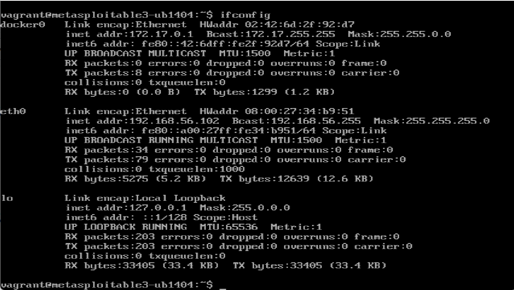

# Phase 1: Setup and Compromise the SSH Service

## Task 1.1: Compromise the SSH Service Using Metasploit

---

## 🎯 Objective
The goal of this task is to **gain unauthorized SSH access** to the victim machine (Metasploitable3) by performing a **brute-force attack** using **Metasploit**. We'll use the Metasploit module `auxiliary/scanner/ssh/ssh_login` to discover valid login credentials.

---

## 🖥️ Environment Setup

- **Attacker Machine**: Kali Linux 
- **Victim Machine**: Metasploitable3 
- **Target Service**: SSH
- **Target IP Address**: `192.168.56.102`
- **SSH Port**: 22 (default)

---

## 🔹 Step 1: Identify Target IP Address

On the victim machine (Metasploitable3), run the following command to get the IP address:
```bash
ifconfig
```


📸 Screenshot:



